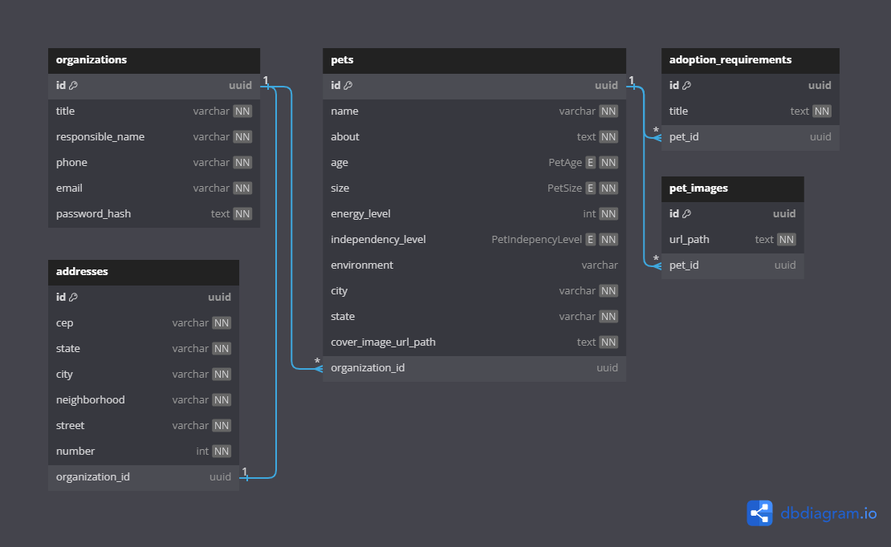

<div align="center">
  
</div>

<h1 align = "center">Find a Friend API</h1>

<p>This back-end application was developed as a challenge for the third chapter of the course about NodeJS, by Rocketseat.</p>

<p>"Find a Friend" is a pet adoption project that simplifies the process of discovering with pets available for adoption in your city.</p>

<p>Organizations can sign up on the application and register pets for adoption. That way, these animals will show up for people who want to adopt  one(s) of them.</p>

<p>During the API development, it was applied some <strong>Design Patterns</strong> and <strong>SOLID Principles</strong>, like Single Responsability, Dependency Inversion, Repository Pattern, Factory Pattern, Test-Driven-Development (TDD), Controllers, etc.</p>

<div align="center">
  <div style="display: flex; justify-content: space-between; align-items: center;">
    
    
    
  </div>
</div>

<h4 align="center"> 
	Find a Friend API | Status: Doing...
</h4>

## Table of Contents

- [Database Model](#database-model)
- [App Requirements and Business Rules](#app-requirements-and-business-rules)
- [API Endpoints](#api-endpoints)
- [Requirements to run the project](#requirements-to-run-the-project)
- [Running the application](#running-the-application)
- [Tests](#tests)
- [Main Technologies](#main-technologies)
- [License](#license)
- [Author](#author)

## Database Model

<p>In this project, PostgreSQL was the Database Management System (DBMS) chosen to persist data.</p>

<p>Right below you can check out the database model and the relationship between tables: </p>



## App Requirements and Business Rules

• Functional Requirements

- [x] It should be possible to register a pet.
- [x] It should be possible to list all pets available for adoption in a city.disponíveis para adoção em uma cidade
- [x] It should be possible to filter pets by their characteristics.
- [x] It should be possible to view details of a pet for adoption.
- [x] It should be possible to register as an organization (ORG).
- [x] It should be possible to log in as an organization (ORG).

• Business rules

- [x] To list pets, it is mandatory to provide the city.
- [x] An organization (ORG) needs to have an address and a WhatsApp number.
- [x] A pet must be associated with an organization (ORG).
- [x] The user who wants to adopt will contact the organization (ORG) via WhatsApp.
- [x] All filters, besides the city, are optional.
- [x] For an organization (ORG) to access the application as an admin, it needs to be logged in.

• Non-Functional Requirements

- [x] The password of the registered organization must be encrypted in the database.
- [x] JWT should be used as the access token for organization authentication.
- [x] Application data must be persisted in a PostgreSQL database.
- [] The list of pets by city and state should be fetched in intervals of 20 items per page.

## API endpoints

### Organizations

1. Register an organization

```bash
    POST /organizations
```

In this request, you have to send the body data containing these fields (In JSON):

```ts
interface BodyRequest {
  title: string;
  responsible_name: string;
  phone: string;
  email: string;
  password: string;

  cep: string;
  state: string;
  city: string;
  neighborhood: string;
  street: string;
  number: number;
}
```

2. Authenticate an organization

```bash
   POST /organizations
```

Send the email and the password through body request.

3. Organization Profile

```bash
   GET /organizations/profile
```

Select 'Bearer' Auth type sending the token that was returned in the authentication request.

```bash
    'Bearer {token}'
```

4. Refresh token

```bash
   PATCH /organizations/token/refresh
```

### Pets

1. Create a pet

```bash
   POST /pets
```

You have to be authenticated as a Organization to perform this HTTP request.

Besides, you have to send the body data containing these fields (In JSON):

```ts
interface BodyRequest {
  name: string;
  about: string;
  age: 'FILHOTE' | 'ADULTO' | 'IDOSO';
  size: 'PEQUENO' | 'MEDIO' | 'GRANDE';
  energy_level: number;
  independency_level: 'BAIXO' | 'MEDIO' | 'ALTO';
  environment?: string;
  adoption_requirements?: string[];
  cover_image_url_path: string;
  images: {
    url_path: string;
  }[];
}
```

2. Pet details

```bash
   GET /pets/:id
```

To get pet details, you have to send the pet id as a parameter in the URL.

Example:

```bash
   GET /pets/pet-01
```

3. Fetch pets in the city

```bash
   GET /pets/nearby
```

To get pet details, you have to send the properties 'city' and 'state' as query params in the URL.

Example:

```bash
   GET /pets/nearby?city=Rio%20de%20Janeiro&state=RJ
```

4. Fetch pets in the city with filters

```bash
   GET /pets/nearby/filter
```

You must send the required query params 'city' and 'state', but the others, like 'age', 'size', 'energy_level' or 'independency_level', are optional.

Example:

```bash
   GET /pets/nearby/filter?city=Rio%20de%20Janeiro&state=RJ&age=ADULTO&size=PEQUENO
```

## Requirements to run the project

<p>Before you run the project, check if you have [Node.js](https://nodejs.org/en/) installed on your machine, as well [Git](https://git-scm.com) to clone this repository.</p>

<p>Besides, you must have Docker installed on your machine to run the PostgreSQL database image in a container.</p>

<p>You must create a ".env" file. Check the ".env" example provided in the root directory with the required variables for the project.</p>

## Running the application

```bash
    # Clone this repository on your machine:
    $ git clone https://github.com/vitorlinsbinski/find-a-friend-api.git

    # Access the project folder in your terminal:
    $ cd find-a-friend-api

    # Install all dependencies:
    $ npm install

    # Install and initialize the database container in Docker:
    $ docker compose up -d

    # Run the application:
    $ npm run dev
```

<p>After that, you may use some API Client to send HTTP requests to the server, like Insomnia, Postman, etc.</p>

## Tests

<p>In this project, Vitest was used as a testing tool to provide us E2E (end-to-end) tests in our routes and unit-tests in our use-cases.</p>

<span>Command to run the unit tests: </span>

```bash
    npm run test
```

<span>Command to run the E2E tests: </span>

```bash
    npm run test:e2e
```

Disclaimer: it's better to run this application if you are using Unix-based operational Systems, like Linux, MacOS or even WSL 2.

## Main Technologies

- [Node.js](https://nodejs.org/)
- [Typescript](https://www.typescriptlang.org/)
- [Fastify](https://www.fastify.io/)
- [PrismaORM](https://www.prisma.io/)
- [PostgreSQL](https://www.postgresql.org/)
- [Zod](https://github.com/colinhacks/zod)
- [Dotenv](https://github.com/motdotla/dotenv)
- [Vitest](https://vitest.dev/)
- [Supertest](https://github.com/ladjs/supertest)

## License

This project is licensed under [MIT](https://choosealicense.com/licenses/mit/) License.

### Author

<a href="https://github.com/vitorlinsbinski">
 
 <br />
 <sub><b>Vitor Linsbinski</b></sub></a> <a href="https://github.com/vitorlinsbinski" title="">🚀</a>

Developed by Vitor Linsbinski

[](https://www.linkedin.com/in/vitorlinsbinski/)
